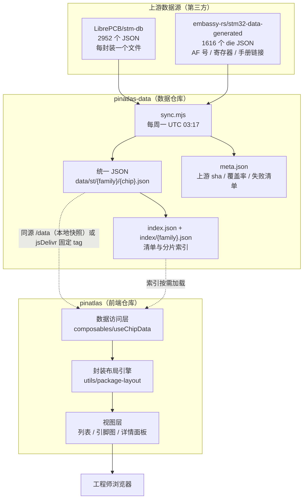
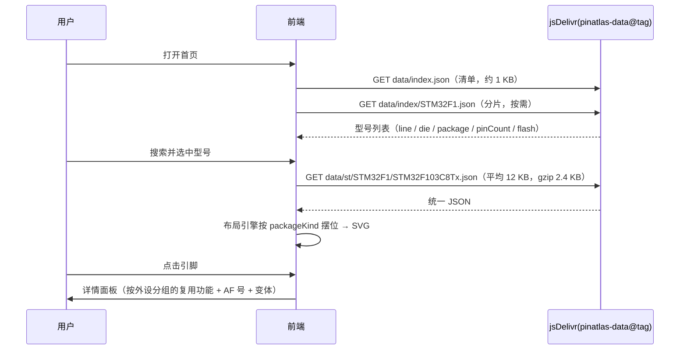

# 01 · 系统架构

## 1. 为什么是这个形态

最初想做的是"在线图形化配置引脚"。调研结论：现有工具要么是桌面软件（STM32CubeMX），要么是单芯片的博客表格，没有面向多厂商的在线引脚库。

而且**引脚与复用功能查询**这件事本身是可控的：数据公开、结构固定、可离线转换。因此 PinAtlas 定位为：

> **通用芯片引脚数据库与可视化查询平台**——不绑定 STM32，不做工程级代码生成。

## 2. 系统组成



## 3. 职责边界

| 层 | 负责 | 不负责 |
|---|---|---|
| 上游仓库 | 原始引脚/功能数据 | 统一格式、校验、可用性 |
| **pinatlas-data** | 抓取、归一化、AF join、校验、版本化发布 | 任何 UI 逻辑 |
| **pinatlas**（前端） | 展示、交互、几何布局、缓存 | 数据转换（前端不做厂商适配） |
| 浏览器 | 渲染与交互 | — |

这条边界的关键是：**前端永远只读一套格式**。新增厂商（ESP32/RP2040/GD32）= 在数据仓库加一个 `convert-xxx` 适配器，前端零改动。

## 4. 运行时数据流



## 5. 技术选型

| 部分 | 选型 | 理由 |
|---|---|---|
| 前端框架 | **Nuxt 4**（Vue 3.5 + Vite） | 现有仓库基线；SSR/静态生成对文档型站点友好；`nitro.prerender` 可预渲染索引页 |
| 样式 | **Tailwind CSS + shadcn-vue** | 用户指定；shadcn 组件是"源码内"的，样式可控、无运行时 UI 库依赖 |
| 组件原语 | Reka UI（shadcn-vue 底层） | 无障碍交互（对话框/下拉/提示）不自己造 |
| 状态 | Pinia（已在基线）+ 组合式函数 | 全局仅"当前选中芯片/主题"这点状态，其余用 composable 局部状态 |
| 引脚图 | 纯 SVG（无 D3） | 引脚矩形 + 文字标签，无需物理力导向；手写能精确控制可点击区域与 label 布局 |
| 数据 | 静态 JSON + fetch（默认同源 `/data`，可切 CDN） | 无后端；数据集由 CI 每周产出；避免浏览器受系统代理/跨域影响 |
| 部署 | Cloudflare Pages / Netlify / GitHub Pages | 纯静态，任选；仓库已含 `netlify.toml` |

### 明确不用

- **UnoCSS**：与 Tailwind 二选一，shadcn-vue 生态基于 Tailwind，故迁移掉 UnoCSS（原 Vitesse 模板残留）。
- **D3**：见上。
- **运行时调用上游 CDN**：上游抖动实测 24% 静默失败（见 `docs/07-development-problems.md`），一律读 `pinatlas-data`。

## 6. 构建与部署

```bash
pnpm build            # Nitro 产物
pnpm generate         # 纯静态（推荐给 Pages）
node .output/server/index.mjs   # 本地预览
```

缓存策略：

- `index/*.json`、`st/**/*.json` 内容随 tag 变化 → `Cache-Control: public, max-age=3600`（CDN 侧 jsDelivr 自身有长期缓存）。
- 前端引用**固定 tag**（如 `@data-2026.09.23`），不要跟 `main`，否则 CDN 缓存会让数据与页面版本错配。
