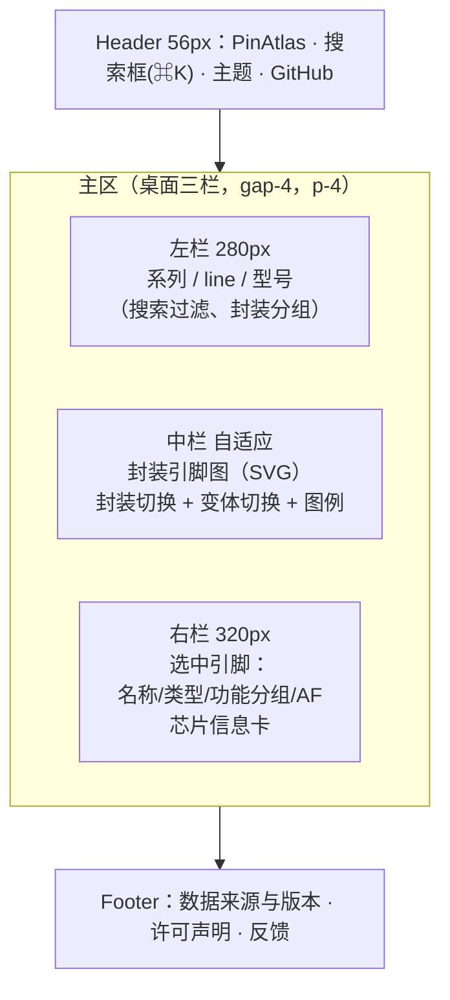

# 04 · UI 设计规范（shadcn-vue 风格）

原则：**中性底色 + 单一强调色 + 极简边框**。数据密集页面，信息层次靠排版和留白，不靠重色块。

## 1. 设计令牌

shadcn-vue 的令牌是 CSS 变量，落在 `app/assets/css/main.css`（亮/暗两套）：

| 令牌 | 用途 | 亮色示例 |
|---|---|---|
| `--background` / `--foreground` | 页面底/正文 | `oklch(1 0 0)` / `oklch(0.145 0 0)` |
| `--card` / `--card-foreground` | 卡片、面板 | 白 / 近黑 |
| `--muted` / `--muted-foreground` | 次级信息、说明文字 | 浅灰 / 中灰 |
| `--border` / `--input` / `--ring` | 分隔线、输入框边框、聚焦环 | 浅灰系 |
| `--primary` / `--primary-foreground` | 主按钮、选中态 | 主题蓝 |
| `--accent` / `--accent-foreground` | 悬停底色 | 极浅 |
| `--destructive` | 错误态 | 红 |
| `--radius` | 圆角基准（`0.5rem`） | 卡片 `radius-lg`、按钮 `radius-md` |

**引脚类型色**（自定义语义令牌，亮暗各一套，保证对比度 ≥ 4.5:1）：

| 类型 | 令牌 | 亮色 | 暗色 | 说明 |
|---|---|---|---|---|
| `io` | `--pin-io` | 灰蓝 | 灰蓝 | 普通 GPIO |
| `power` | `--pin-power` | 红 | 亮红 | 电源 |
| `ground` | `--pin-ground` | 深灰 | 中灰 | 地 |
| `reset` | `--pin-reset` | 橙 | 亮橙 | 复位 |
| `boot` | `--pin-boot` | 紫 | 亮紫 | 启动模式 |
| `mono` | `--pin-mono` | 青 | 亮青 | 单功能（VREF+/DNU…） |
| `nc` | `--pin-nc` | 极浅灰（虚线边） | 深灰（虚线边） | 未连接 |
| `other` | `--pin-other` | 中性 | 中性 | 兜底 |

引脚填充用 `令牌色/15%`，边框用令牌本色 —— 这样暗色下也不会刺眼。

## 2. 组件清单（shadcn-vue）

| 组件 | 用在哪 |
|---|---|
| `Button` | 重试、切换封装、复制引脚名 |
| `Input` | 芯片搜索 |
| `Badge` | 引脚类型、AF 号、`AF 未知`、数据来源 |
| `Card` | 芯片信息卡、详情面板分组 |
| `Tabs` | 详情面板：`复用功能` / `变体` / `电气`（后续） |
| `Separator` | 分组之间 |
| `Tooltip` | 引脚悬停显示 pad 名 + 前 3 个功能 |
| `ScrollArea` | 左栏型号列表、右栏功能列表 |
| `Sheet` / `Drawer` | 窄屏时左栏/详情面板改为抽屉 |
| `Command`（可选） | `⌘K` 全局搜索 |
| `Skeleton` | 加载态 |
| `Alert` | 错误态 + 重试 |
| `ToggleGroup` | 亮/暗主题、变体切换 |

图标：`@iconify-json/carbon`（仓库已装），统一 `i-carbon-*`。

## 3. 布局

- 三栏用 CSS Grid：`grid-cols-[280px_minmax(0,1fr)_320px]`；`< lg` 折叠为"列表 ⇄ 图"两态（详情用底部 Sheet）。
- 中栏引脚图**居中**并保持纵横比：容器 `aspect-square`（方封装）或按 `rows/cols` 比例；`max-h-[70vh]`。
- 留白：卡片内 `p-4`、栏间 `gap-4`、区块间 `space-y-2`；正文 `text-sm`，次要 `text-xs text-muted-foreground`。

## 4. 关键交互

| 交互 | 行为 |
|---|---|
| 点击引脚 | 右栏显示详情；该引脚 `ring-2 ring-ring`；键盘可聚焦 |
| 悬停引脚 | Tooltip：`22 · PA11 [PA9]` + 前 3 个功能 + "还有 N 个" |
| 切换封装 | 中栏与右栏保持（同 die）→ 只换数据文件；引脚号可能不同 → 右栏保留 pad，提示"该封装无此引脚" |
| 切换变体 | 引脚图重算（变体可能把某脚变 NC 或换功能），顶栏显示 `变体：PINREMAP` Badge |
| 搜索 | 防抖 200 ms，匹配 `chip` / `displayName` / `line`；高亮命中片段 |
| 空/错/加载 | 空态给"未收录 + 数据源链接"；错误态给重试；加载用 Skeleton（不要转圈） |
| AF 未知 | 显示 `—` + 一行说明"该系列上游无 AF 号数据"（**不要显示 AF0**） |

## 5. 引脚图视觉规范（Canvas 渲染）

渲染方式：**Canvas 2D**（`app/utils/canvas-render.ts`），几何来自纯函数 `layoutPackage()`。

- 画布按 `devicePixelRatio` 放大后在**逻辑坐标系（0..1000）**里作画（`setTransform` 一次），CSS 尺寸随容器走（ResizeObserver）。
- 颜色**不写死**：绘制时从 CSS 变量读（`--pin-*`、`--border`、`--ring`…），主题切换重读调色板并重绘。
- 引脚填充用 `globalAlpha 0.18` 的类型色、描边用本色；`nc` 类型用 `setLineDash([6,4])`；图例过滤时其余类型 `globalAlpha 0.22` 变淡。
- 命中检测、方向键导航都是几何计算（`hitTestSlots` / `neighborSlot`），见 `docs/05 §8`。
- 引脚矩形：长边 `18px`（quad 沿边）/ 球 `r=9px`（grid）；间距 `4px`；圆角 `radius-sm`。
- 标注：quad/dual 在矩形外侧标 `position`，内侧标 `pad`（空间不足时只标 position + tooltip）；grid 在球心标 `A1/B7`。
- Pin 1 标记：右上/左上角一个实心小圆 + 一条加粗边框（**方向必须与数据手册一致**，见 05 §4）。
- 图例（类型色）固定在图下方，可点击筛选高亮（如"只看电源"）。
- 图底部固定一行灰字：`示意排布，非按比例；pin1 位于左上（俯视）`。

## 6. 响应式断点

| 宽度 | 布局 |
|---|---|
| `≥1280px` | 三栏 |
| `1024–1279px` | 两栏（列表可折叠 + 图 + 详情 Sheet） |
| `<1024px` | 单栏：搜索 → 列表 → 图，详情用底部 Sheet |
